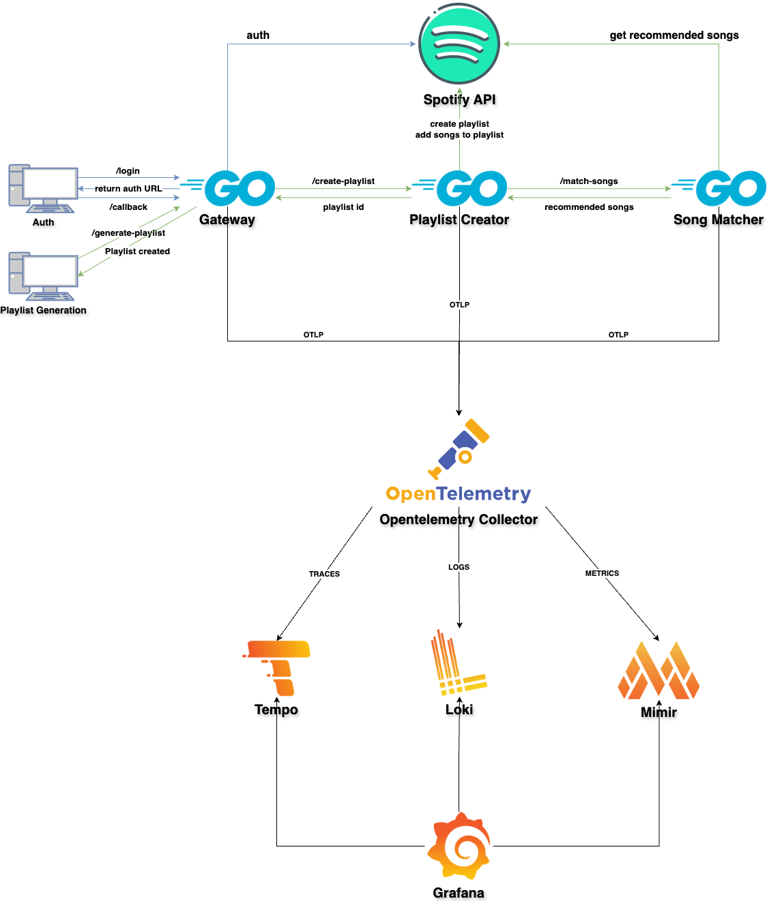

# Opentelemetry Playlist Generator

## Introduction

The OpenTelemetry Playlist Generator is designed to create personalized playlists based on user preferences. It leverages OpenTelemetry for observability and monitoring the application's performance and behavior. The purpose of this project is to demonstrate how OpenTelemetry can be instrumented in a Go application to collect and export telemetry data to an observability backend.

## Architecture

It is composed of three microservices:

1. **Gateway**: This service is the entry point for the application. It collects user preferences and sends them to the Playlist Creator service.
2. **Playlist Creator**: This service receives user preferences from the Gateway service and requests song recommendations from the Song Matcher service. When it receives the song recommendations, it creates a playlist in the user Spotify account.
3. **Song Matcher**: This service receives user preferences from the Playlist Creator service and returns song recommendations based on the user preferences.

[](./docs/architecture.png)

## Getting Started

### Prerequisites
- Container runtine (Docker, Podman, Colima, etc.)
- Docker Compose
- Spotify Developer Account

### Spotify Setup
1. Create a Spotify Developer Account at https://developer.spotify.com/
2. Navigate to Dashboard https://developer.spotify.com/dashboard and create a new Spotify application
3. Add the following redirect URI to the Spotify application:
    - http://localhost:8080/callback
4. Click in Settings in the new created application and copy the Client ID and Client Secret
5. Update `.env` file in the root of the project and add your credentials in the environment variables:
    ```shell
    SPOTIFY_ID=<your-client-id>
    SPOTIFY_SECRET=<your-client-secret>
    ```

### Running the Project
1. Start the services using Docker Compose:
    ```shell
    make start
    ```
2. Authenticate with Spotify by following the instructions in the terminal:
    ```shell
    make auth
    ```
3. Send a request to create a playlist based on your preference. Preference can be updated on `request.json` file:
    ```shell
    make create-playlist
    ```
    ps.: There is a limit of 5 seeds (artists + genres) for the recommendations. 

### Looking for the Observability results
1. Access Grafana at http://localhost:3000.
2. Explore logs, traces, and metrics in the Explore tab.
3. Access the Demo Dashboard to see the application's performance and behavior.
 